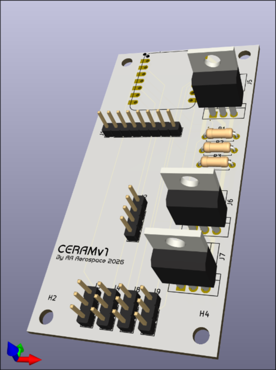

# CERAM
CERAM - Cost-Effective Rocket Aviation Module

## Why
Most rocket flight computers are made of SMD components and are designed to be made at scale by automated pick and place machines, but these methods are extremely expensive if you aren't manufacturing at scale.

## Schematic
~[Schematic](assets/schematic.png)

## PCB
~[PCB](assets/pcb.png)
